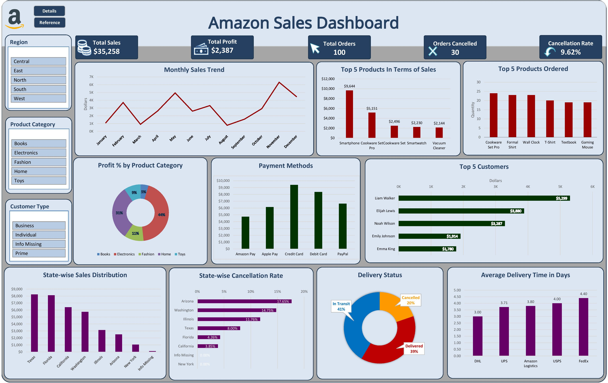

# Retail Sales Analysis (Excel Project)

## Objective
Analyze retail sales data to identify top products, seasonal trends, and regional performance.

## Tools Used
- Microsoft Excel (PivotTables, Charts, Conditional Formatting)

## Steps Taken
- Cleaned dataset (removed duplicates, handled missing values).
- Created PivotTables to summarize sales by product, region, and month.
- Built interactive dashboard with slicers.

## Insights
- Top revenue came from electronics category.
- Peak sales observed during festive months (Oct–Dec).
- South region showed consistent growth compared to others.

## Dashboard

