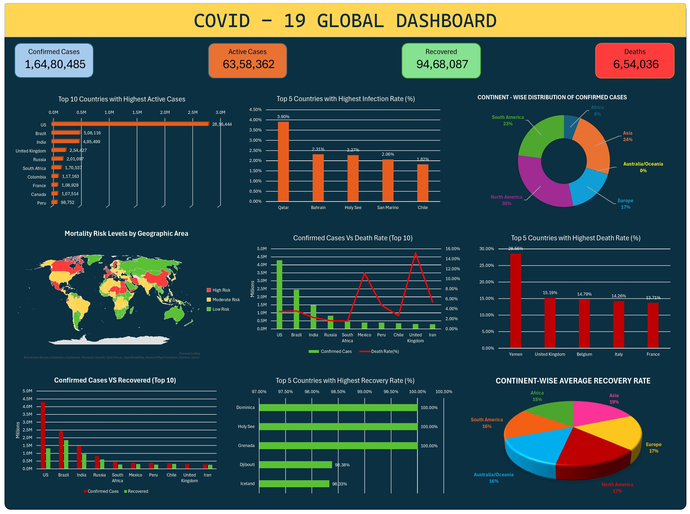

COVID-19 Global Dashboard (Excel)

This is a COVID-19 dashboard I built in Excel to turn raw numbers into something that’s easier to understand at a glance. Instead of scrolling through tables of data, you can quickly see which countries were most affected, how recovery looked across different regions, and how the pandemic spread around the world.

🔹 Key Insights from the Dashboard

- **Overall Statistics:**

- Confirmed cases, Active cases, Recoveries, and Deaths at a global level.

- Country-Level Analysis:

- Top 10 countries with the highest active cases.

- Top 5 countries with the highest infection rate (%).

- Top 5 countries with the highest recovery and death rates.

- **Continent-Level Trends:**

- Distribution of confirmed cases across continents.

- Average recovery rates by continent.

- **Comparative Analysis:**

- Confirmed vs. Recovered cases (Top 10 countries).

- Confirmed vs. Death rate (Top 10 countries).

**Geographic Risk Map:**

- Mortality risk levels visualized globally (High, Moderate, Low).

**Tools & Techniques Used**

- Microsoft Excel for data cleaning, transformation, and dashboard creation.

- Charts & Visualizations: Bar charts, Pie charts, Line graphs, and Geographic map visuals.

- Dynamic Design: Easy to interpret and visually appealing, showing both absolute numbers and percentages.

🚀 Purpose
This project was my way of practicing data storytelling – not just crunching numbers but presenting them in a way anyone can follow. It also shows how powerful Excel can be when it comes to analyzing and visualizing real-world data.

## 📊 Dashboard Preview

